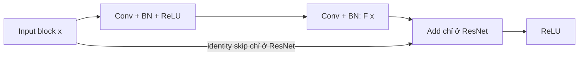

# CNN và ResNet: thêm gì để tạo khác biệt?

ResNet vẫn là mạng CNN. Biến thể nhỏ trong dự án dùng cùng 8 Conv, BatchNorm,
ReLU và head với CNN; thêm **identity skip connection** qua 3 cặp Conv.
Đây là ResNet phục vụ đối chứng, không phải ResNet-18 chuẩn.

Hai kiến trúc được viết độc lập trong `models/cnn.py` và `models/resnet.py`,
đều kế thừa trực tiếp `nn.Module`. Mỗi file có layers, khởi tạo weights và
forward riêng; CNN không chứa cờ residual. Chỉ phần vẽ activations dùng chung.
Khi chạy `uv run train.py`, hai kiến trúc được in cạnh nhau trước khi train,
kèm đường đi forward và vị trí skip, rồi lưu vào `architectures.txt` trong
thư mục kết quả. Log mỗi epoch hiển thị CNN và ResNet cạnh nhau.

| Thành phần | CNN trong benchmark | ResNet trong benchmark |
| --- | --- | --- |
| Input | RGB 3×32×32 | RGB 3×32×32 |
| Stem | Conv 3→32 → BN → ReLU → Conv 32→32 → BN → ReLU | Giống CNN |
| 3 block | ReLU(F(x)) | **ReLU(F(x) + x)** |
| F(x) trong mỗi block | Conv → BN → ReLU → Conv → BN | Giống CNN |
| Các Conv | kernel 3, stride 1, padding 1; output 32×32×32 | Giống CNN |
| Pool | MaxPool(3): 32×10×10 → AdaptiveAvgPool: 32×1×1 | Giống CNN |
| Head | Flatten → Linear 32→3 → ReLU → Linear 3→10 | Giống CNN |
| Tham số thêm | — | 0; cộng tensor không có weights |



CNN bỏ phép Add và nối F(x) trực tiếp vào ReLU. Skip đưa thông tin đầu vào
đến cuối block và tạo đường truyền gradient trực tiếp qua phép cộng. Trước
ReLU, đạo hàm của F(x)+x có thêm thành phần identity; điều này có thể giúp tối ưu
mạng sâu. Không đảm bảo ResNet luôn đạt accuracy cao hơn ở mọi lần chạy.

CNN cũ (`CNN()` hoặc `--model legacy-cnn`) vẫn dùng padding 0. Cặp benchmark
đều dùng padding 1 để hai nhánh có cùng shape và phép cộng không cần projection.
Vì vậy không dùng accuracy CNN cũ để kết luận tác dụng riêng của skip.
Head 32→3→10 được giữ để đối chứng; bottleneck 3 chiều có thể hạn chế cả hai model.

## Chạy trên Kaggle

Trong thư mục repository có `pyproject.toml`, `src/` và `configs/`, bật GPU và
Internet cho lần tải dữ liệu đầu, rồi chạy:

```bash
uv run train.py
```

Lệnh tự chuẩn bị CIFAR-10 nếu chưa có cache, train đồng thời CNN và ResNet, mỗi model
50 epochs theo `configs/cifar10.toml`, tự chọn CUDA và AMP nếu có GPU. Với T4 x2,
CNN dùng `cuda:0`, ResNet dùng `cuda:1`; với một GPU, hai model dùng chung GPU.
Nếu không có CUDA sẽ chạy CPU và ghi device vào báo cáo. Phân bổ GPU lưu trong
`devices.json`, theo thứ tự GPU hiển thị cho PyTorch. Chạy notebook
thì thêm `!` trước lệnh. Cần có `uv` trong môi trường.

Hai tiến trình được reset cùng seed nên các trọng số có cùng khởi tạo, cùng
thứ tự minibatch, split, optimizer Adam, learning rate và số epoch. Test chỉ
được đánh giá sau khi chọn checkpoint bằng validation. Một seed là một phép
đối chứng ban đầu; để kết luận ổn định, chạy thêm các seed bằng `--seed`.

Kết quả ở `outputs/benchmark/<timestamp>/`: `benchmark.csv`, `benchmark.json`,
`benchmark.md`, `benchmark.png` (loss, validation accuracy, thời gian mỗi epoch).
Mỗi thư mục `cnn/`, `resnet/` có checkpoint, metrics, split và predictions riêng.
Không có số liệu benchmark giả lập: accuracy và hiệu năng được ghi từ lần chạy.
Thời gian train gồm truyền dữ liệu và optimizer; có đồng bộ CUDA trước/sau đo.
Peak memory là tensor memory được cấp phát trong train/validation, không phải
VRAM reserved, ghi riêng từng tiến trình. Với hai GPU, hai model dùng GPU riêng
nhưng vẫn chia sẻ CPU, RAM và ổ đĩa. Với một GPU, thời gian còn chịu ảnh hưởng
tranh chấp GPU; đây không phải phép đo latency inference.

Có thể tùy chỉnh mà không sửa code:

```bash
uv run train.py --epochs 5 --batch-size 128 --seed 123
```
